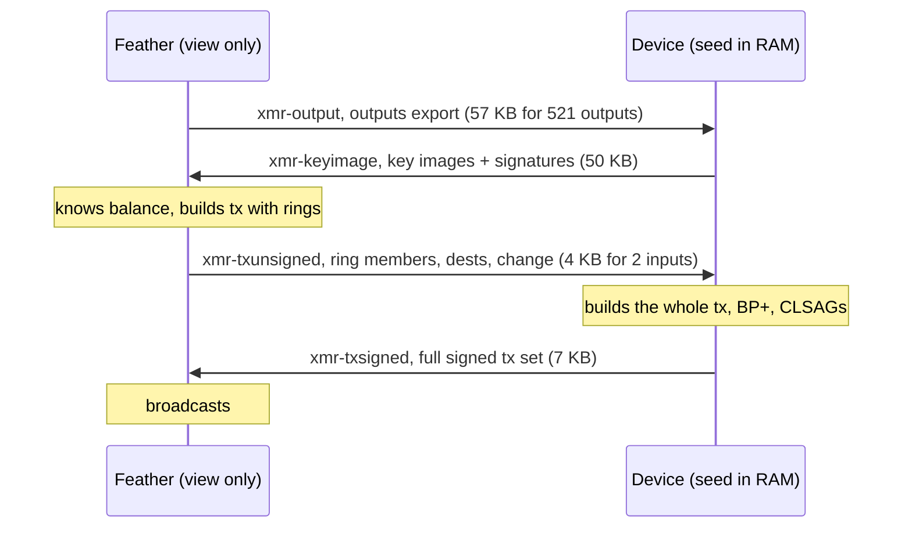
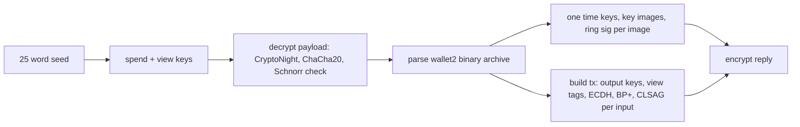
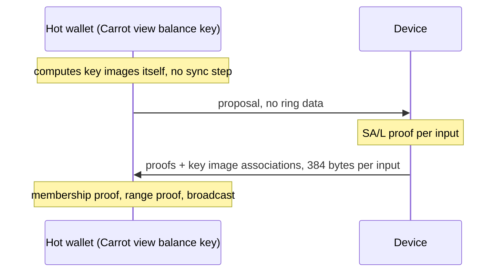

# Monero cold signing on a Pi Zero 1.3

Feasibility spike: a SeedSigner class device (Raspberry Pi Zero 1.3, one ARMv6 core, 512 MB, no wireless, nothing persisted) as a Monero cold signer for an unmodified Feather Wallet. Stagenet only. This covers the signing core and the numbers, not the camera round trip or the device UI.

## Round trip

Feather's offline signing wizard exchanges four payloads with a cold signer. They are wallet2's own cold signing blobs, encrypted to the view key, wrapped as a CBOR byte string in the Keystone `xmr-*` UR types. Nothing else is in there, the spec from Feather's source is in [xmr-signer/FORMATS.md](xmr-signer/FORMATS.md).

The first two steps happen once per new batch of outputs (Feather only exports outputs whose key images it does not know), the last two on every spend.

## Signer

`libmonero-signer`, about 1500 lines of Rust on [monero-oxide](https://github.com/monero-oxide/monero-oxide).

On the current protocol the cold side builds the complete transaction, the fee is implied by the amounts. monero-oxide's high level builder is fee rate driven so the tx is assembled from its primitives. Written on top of monero-oxide: the binary archive reader/writer, CryptoNight (Cuprate's pure Rust crate), the one member ring signature wallet2 wants per key image, the Schnorr signature of the wrapper.

## Validation

- Key images for a 33 output export match wallet2's one by one, both signature sets verify, monero-wallet-cli imports the reply into a view only wallet with the right balance.
- A signed set from a wallet-rpc view only wallet is accepted by that wallet and by the daemon. 2191 bytes, the weight wallet2 predicted.
- Feather 2.8.1, file transport, full round trip as in the diagram, broadcast, mined in stagenet block 2209404 (`8a4268bbdc24b2d82c06ca7a5db34cccaf7c96a93d4e5fd56944ef3ff18847b2`). No Feather changes.
- Cupcake uses monero_c, which is wallet2 with the same four UR types. Should work unchanged, only checked by reading the code.

## Numbers

Pi Zero Rev 1.3, static ARMv6 musl release build, medians of 20 runs. Raw outputs in `xmr-signer/dist/`. Three stagenet wallet snapshots.

| Wallet outputs | Outputs export | Key image reply | Unsigned tx, 2 in | Signed set, 2 in |
|---|---|---|---|---|
| 51 | 20545 bytes | 5060 bytes | 4275 bytes | 6803 bytes |
| 215 | 33381 bytes | 20804 bytes | 4120 bytes | 6666 bytes |
| 521 | 57296 bytes | 50180 bytes | 4198 bytes | 6739 bytes |

16 inputs: about 22 KB unsigned, 35 KB signed, at any wallet size. The 51 output export is fat because 33 of those outputs came from txs paying 15 subaddresses each and wallet2 attaches 16 additional tx pubkeys to every one of them (about 580 bytes per output, vs about 80). The other snapshots use plain payments.

| Operation | Median |
|---|---|
| Decrypt + parse any payload | 0.74 s, almost all CryptoNight |
| Key images, 51 / 215 / 521 outputs | 1.66 s / 4.2 s / 8.9 s |
| Sign 2 inputs | 4.5 s |
| Sign 16 inputs | 9.0 to 10.1 s |

Peak RSS about 4 MB. Key images are about 16 ms per output plus one CryptoNight for the reply, signing does not depend on wallet size.

QR frames at 120 bytes per fragment (the SeedSigner shell's high density):

| Payload | Frames |
|---|---|
| Outputs export, 521 outputs | 478 |
| Key image reply, 521 outputs | 419 |
| Unsigned tx, 2 inputs | 35 |
| Signed set, 2 inputs | 56 |
| Signed set, 16 inputs | 293 |

The shell's default density is 30 bytes per fragment, four times these counts, it was tuned for PSBTs.

Compute wise this is hardware wallet territory (Ledger's Monero app takes minutes, Trezor tens of seconds, Cupcake on a phone is instant). What makes it slow is the protocol: the key image sync before the hot wallet knows its balance, and 16 ring members per input in the unsigned tx. A routine 2 input spend is still around 90 frames each way on a 240x240 LCD at 6 fps plus two CryptoNight hashes.

## FCMP++

With the hot/cold design in [seraphis-migration/monero#52](https://github.com/seraphis-migration/monero/pull/52) the round trip becomes two steps and the device does much less:

monero-oxide's `fcmp++` branch exposes the SA/L proof, so it was measured on the same hardware (`xmr-signer/fcmp-bench`, synthetic outputs as in the crate's own test, branch commit 31c26d96):

| Inputs | Rerandomize | SA/L prove | Total | Current protocol |
|---|---|---|---|---|
| 1 | 17 ms | 44 ms | 61 ms | ~4.3 s |
| 2 | 34 ms | 87 ms | 121 ms | 4.5 s |
| 16 | 269 ms | 700 ms | 969 ms | 9 to 10 s |

Caveats: proposal format and encryption are not specified yet (keeping todays wrapper adds 0.7 s of CryptoNight per payload on this CPU), the PR was closed to be split up, and legacy keyed wallets keep the key image sync since a legacy view key cannot compute key images. The hardware is fine, the current protocol is what makes it slow.

## Decisions

| Choice | Taken | Why |
|---|---|---|
| Rust on monero-oxide vs wallet2 C++ | Rust | day one gate passed: key images on ARMv6, all 256 upstream vectors, fallback never needed |
| Pi Zero 1.3 vs Zero 2 W | 1.3 | the 2 W is about five times faster but has a radio |
| Fixture source | Feather for the first export and one tx, monero-wallet-rpc for the rest | same wallet2 code path, identical bytes, no GUI clicking per snapshot |

Provenance sits next to every fixture.

## Layout

- [SPEC.md](SPEC.md): task as written before starting.
- [REPORT.md](REPORT.md): full tables, findings, decision record.
- [xmr-signer/FORMATS.md](xmr-signer/FORMATS.md): payload formats.
- [xmr-signer/PI_RUN.md](xmr-signer/PI_RUN.md): how each number was produced, bench card setup (USB gadget ethernet, the Pi has no network).
- [STAGE2-NOTES.md](STAGE2-NOTES.md): integration into the SeedSigner shell.
- `xmr-signer/crates/`: `libmonero-signer`, `xmr-keys`, `xmr-signer-cli`, `spike-bench`, `xmr-gate`.
- `xmr-signer/fcmp-bench/`: FCMP++ measurement, separate workspace (different monero-oxide branch).
- `xmr-signer/fixtures/`: stagenet payloads with provenance.

The test wallet's private view key is in the report, the fixtures are encrypted to it. Seed and spend key are not in the repo.

`scripts/build-armv6.sh spike-bench` builds the ARMv6 binary with cargo-zigbuild, PI_RUN.md has the rest. The FCMP++ bench needs no fixtures or seed.

## License

This project is licensed under the MIT License, see [LICENSE](LICENSE) for details.
